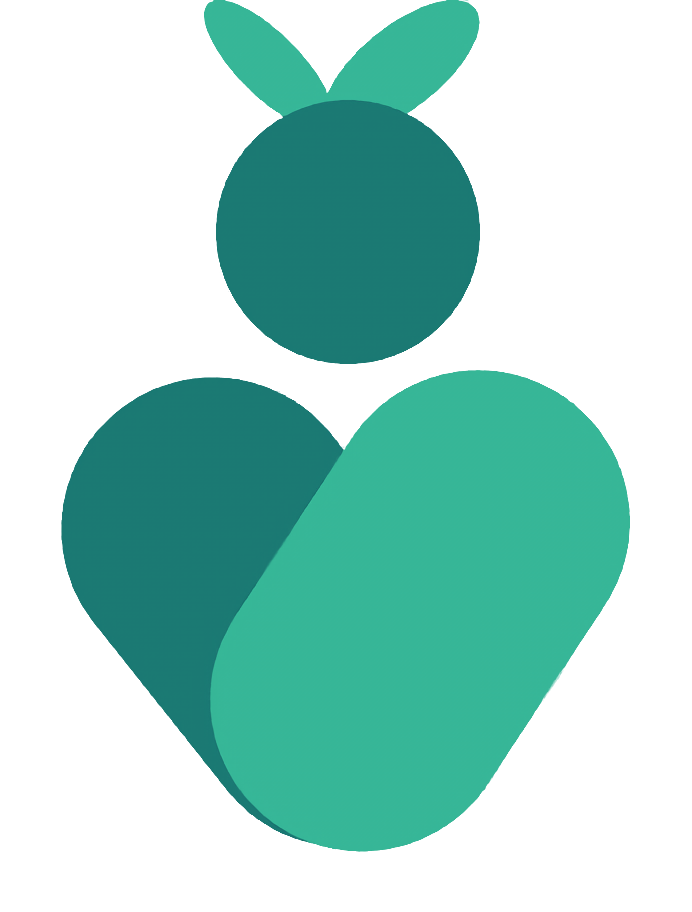

	

    Deteksi dan Tracking Gula Makanan

## Introduction

Welcome everyone to the Sahabat Gula repository, an application for Bangkit Capstone Project with team ID **C242-PS390**. This organization is where we store our application code and its documentation.

Our team consists of seven people divided into three divisions, Cloud Computing, Machine Learning, and Mobile Development divison. Here are the members of our team:

| Name                       | Bangkit ID   | Learning Path      |
| -------------------------- | ------------ | ------------------ |
| Ahmad Rehan Al Fariz       | M009B4KY0223 | Machine Learning   |
| Siti Sholikhatul Janah     | M284B4KX4182 | Machine Learning   |
| Yasita Nursiva             | M296B4KX4521 | Machine Learning   |
| Muhammad Brian Azura Nixon | C128B4KY2765 | Cloud Computing    |
| Shaquille Arriza Hidayat   | C128B4KY4126 | Cloud Computing    |
| M. Ilham Abdul Shaleh      | A253B4KY2319 | Mobile Development |
| Nazila Imkani              | A253B4KX3308 | Mobile Development |
